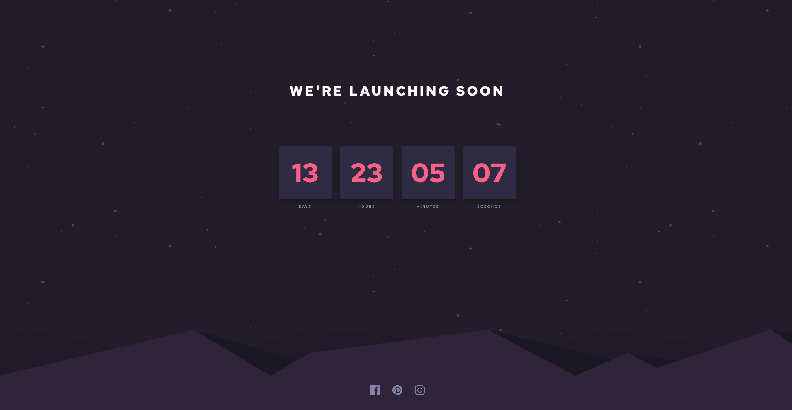

# Launch countdown timer

This is a solution to the [Launch countdown timer challenge on Frontend Mentor](https://www.frontendmentor.io/challenges/launch-countdown-timer-N0XkGfyz-).

## Table of contents

- [Overview](#overview)
  - [The challenge](#the-initial-challenge)
  - [Screenshots](#screenshots)
  - [Built With](#built-with)

## Overview
A simple react app that displays the time left for a date 14 days ahead..

### The initial challenge

Users should be able to:
- See a live countdown timer that ticks down every second (starting the count at 14 days)

### Screenshots

### Built with

- [React](https://reactjs.org/) - JS library
- CSS custom properties
- Flexbox
- CSS Grid
- Mobile-first workflow