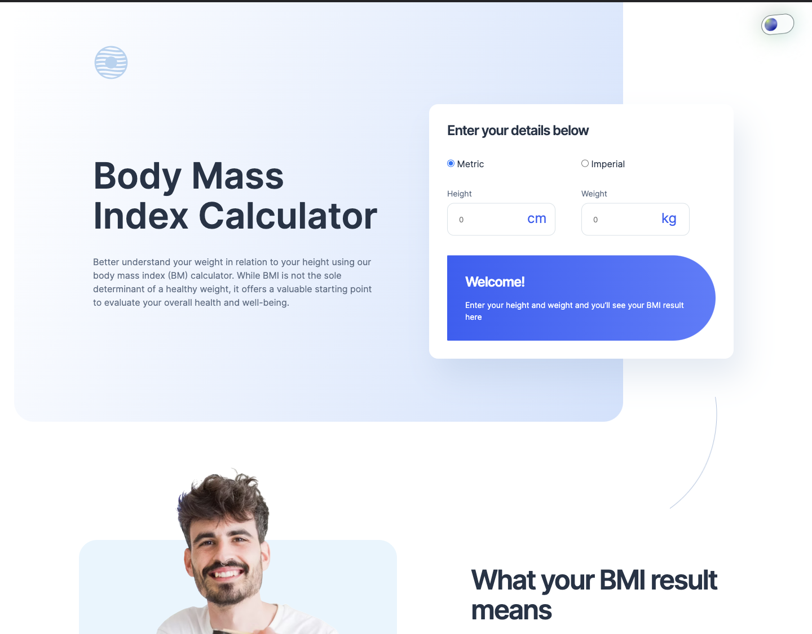

# Frontend Mentor - Body Mass Index Calculator solution

This is a solution to the [Body Mass Index Calculator challenge on Frontend Mentor](https://www.frontendmentor.io/challenges/body-mass-index-calculator-brrBkfSz1T). Frontend Mentor challenges help you improve your coding skills by building realistic projects. 

## Overview

### Screenshot

## My process

### Built with

- Semantic HTML5 markup
- CSS custom properties
- Flexbox
- CSS Grid
- [React](https://reactjs.org/) - JS library

### What I learned

During this project, I enhanced my skills in using React hooks, specifically useContext. The useContext hook is a built-in hook in React that allows you to use Context and access it within a functional component. It provides a neat way to pass data throughout the component tree without having to pass props down manually at every level.

In addition, I deepened my understanding of the parseFloat function in JavaScript.

