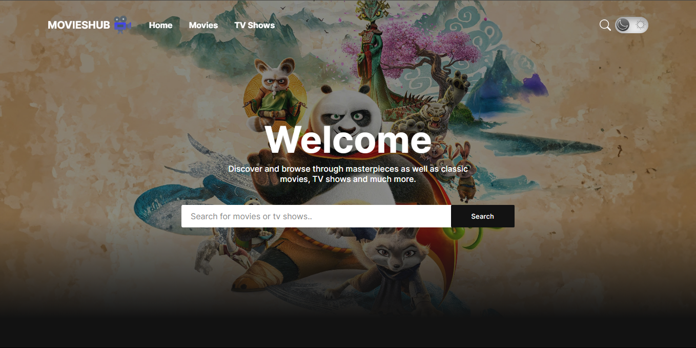

<div align="center">
  
[](https://twitter.com/intent/follow?screen_name=iamt_toby)
[](https://github.com/richdede)
[](https://www.linkedin.com/in/dee-prince-dede-970913217/)
[](https://www.instagram.com/iamt_toby/)

  <br />
  <br />

<h1 align="center">MoviesHub - Movie App</h1>

<p align="center">A fully responsive react-based website built using The Movie Database (TMDB). This app allows users to browser through both movies and tv shows in various ways.</p>


### Demo Screeshots



<br />

## 🛠 Installation and Setup 

Run the following commands:

``` bash
# Install packages and dependencies
npm install

# Run development server
npm run dev

# Build for production in the dist directory
npm run build
```
