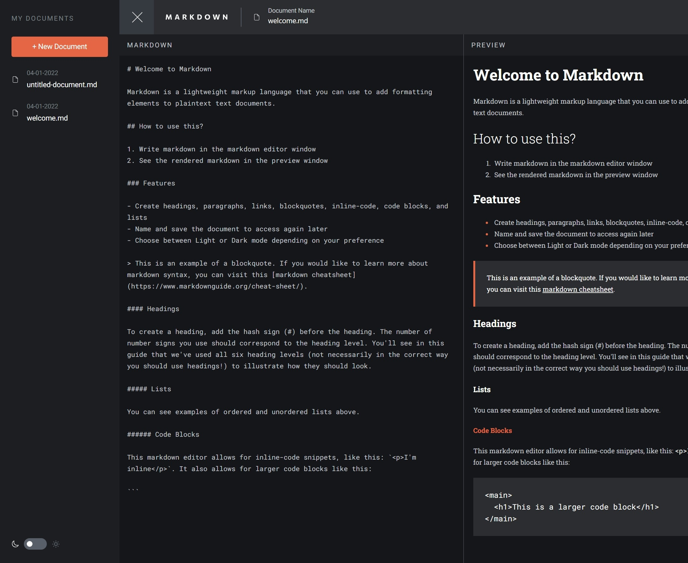

# Frontend Mentor - In-browser markdown editor solution

This is a solution to the [In-browser markdown editor challenge on Frontend Mentor](https://www.frontendmentor.io/challenges/inbrowser-markdown-editor-r16TrrQX9). Frontend Mentor challenges help you improve your coding skills by building realistic projects.

## Table of contents

- [Frontend Mentor - In-browser markdown editor solution](#frontend-mentor---in-browser-markdown-editor-solution)
  - [Table of contents](#table-of-contents)
  - [Overview](#overview)
    - [The challenge](#the-challenge)
    - [Screenshot](#screenshot)
    - [Links](#links)
  - [My process](#my-process)
    - [Built with](#built-with)
    - [What I learned](#what-i-learned)
      - [React Recoil](#react-recoil)
      - [React-markdown](#react-markdown)
      - [Radix-UI](#radix-ui)
    - [Continued development](#continued-development)
  - [Author](#author)
  - [Acknowledgments](#acknowledgments)

## Overview

### The challenge

Users should be able to:

- Create, Read, Update, and Delete markdown documents
- Name and save documents to be accessed as needed
- Edit the markdown of a document and see the formatted preview of the content
- View a full-page preview of the formatted content
- View the optimal layout for the app depending on the device's screen size
- See hover states for all interactive elements on the page
- **Bonus**: If you're building a purely front-end project, use localStorage to save the current state in the browser that persists when the browser is refreshed
- **Bonus**: Build this project as a full-stack application

### Screenshot



### Links

- Solution URL: [https://github.com/kamiliano1/in-browser-markdown-editor](https://github.com/kamiliano1/in-browser-markdown-editor)
- Live Site URL: [https://in-browser-markdown-editor-omega.vercel.app/](https://in-browser-markdown-editor-omega.vercel.app/)

## My process

### Built with

- Semantic HTML5 markup
- CSS custom properties
- FlexBox
- CSS Grid
- Mobile-first workflow
- [React](https://reactjs.org/) - JS library
- [Next.js](https://nextjs.org/) - React framework
- [React Recoil](https://recoiljs.org/)
- [radix-ui](https://www.radix-ui.com/)
- [react-markdown](https://www.npmjs.com/package/react-markdown)

### What I learned

#### React Recoil

To manage the state I've used

```js
markdownAtom.ts;
```

```ts

type MarkdownDataType = {
  createdAt: string;
  name: string;
  content: string;
  id: string;
};

  data: MarkdownDataType[];
  isLightMode: boolean;
  isSidebarOpen: boolean;
  isDeleteModalOpen: boolean;
  activatedMarkdownPart: ActivatedPartType;
  activeMarkdownId: string;
  inputMarkdownValue: string;
  isReloaded: boolean;
```

isReloaded is created to prevent the infinite loop

#### React-markdown

The first time I used it. Was surprisingly easy to implement markdown to the project. More work was done with formatting elements to match the design.

#### Radix-UI

To improve accessibility:

- radix-ui/react-switch - light and dark mode switcher
- radix-ui/react-dialog - delete markdown modal
- radix-ui/react-navigation-menu - navbar and sidebar with keyboard navigation

### Continued development

- Finish this project as full-stack with logging features,
- load and save markdown from and to the file,
- implement different color palettes,

## Author

- Website - [Kamil Szymon](https://github.com/kamiliano1)
- Frontend Mentor - [@kamiliano1](https://www.frontendmentor.io/profile/kamiliano1)
- Twitter - [@k_p_szymon](https://twitter.com/k_p_szymon)

## Acknowledgments

I had problems with implementing table of contents and clickable heading. I've used the solution provided by [sobelk](https://gist.github.com/sobelk/16fe68ff5520b2d5e2b6d406e329e0de)
