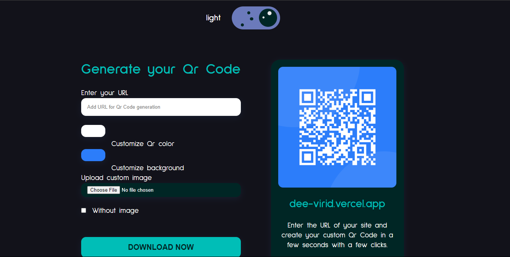

  

   
   

  <h2 align="center">30 Days Of React: Context </h2>

### Demo Screeshots

 

# Context

Context allow as to pass data through the component tree without having to pass props down manually to every child component at every level.

In React, data is passed top-down (parent to child) via props, but this can be cumbersome for certain types of props (e.g. locale preference, UI theme) that are required by many components within an application. Context provides a way to share values like these between components without having to explicitly pass a prop through every level of the tree.

## When to Use Context

Context is designed to share data that can be considered “global” for a tree of React components, such as the current authenticated user, theme, or preferred language. For example, in the code below we manually thread through a “theme” prop in order to style the Button component:

The above text has been taken from [react documentation](https://reactjs.org/docs/context.html) without any change.

It seems the react documentation has pretty good information about context, you can go through the [react documentation](https://reactjs.org/docs/context.html).
