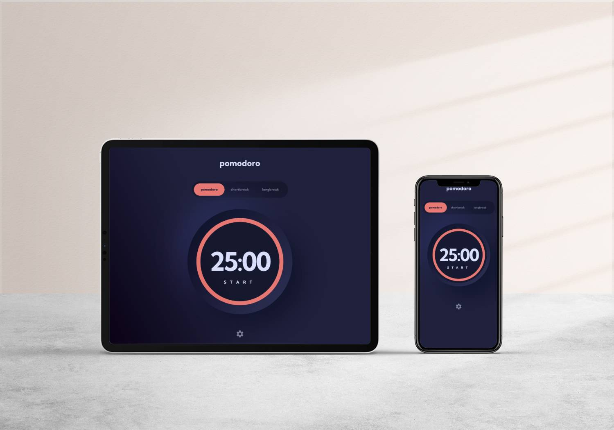

# A Pomodoro-like Timer App 

An app that allows you to set a timer for any duration. Built with React and TypeScript.

## Tech Stack
- React
- TypeScript
- Material-UI

## Features

 - Set a timer for any duration
 - Intuitive interface
 - Customizable theme
 - Responsive design

## Project Setup

In the project directory, you can run:

### `npm start`

Runs the app in the development mode.\
Open [http://localhost:3000](http://localhost:3000) to view it in your browser.

- This app was developed using React, TS and MUI. This combination allows for a fast and responsive app as well as a clean and maintainable codebase.
- The app is fully responsive and can be used on any device.
// Describe architecture and design patterns used
- When building the app I used useContext to manage the state of the app. This allowed me to pass the state down to the components that needed it without having to use prop drilling.
// describe how I paid attention to clean code and best practices
- Paid attention to component naming and structure, as well as the use of hooks and the separation of concerns.
 - Applied linting and formatting rules to ensure a clean and consistent codebase.

Question to community:
- How did you handle the 'Apply' button? I struggled with it a bit because of the <Dialog> component handling overflow property and hiding child component beyond it's boundaries. I would like to know how you handled it.
- How would you handle the timer? I used setInterval because it's simple, and it works, but I'm not sure if it's the best way to handle it. I would like to know how you would handle it.
